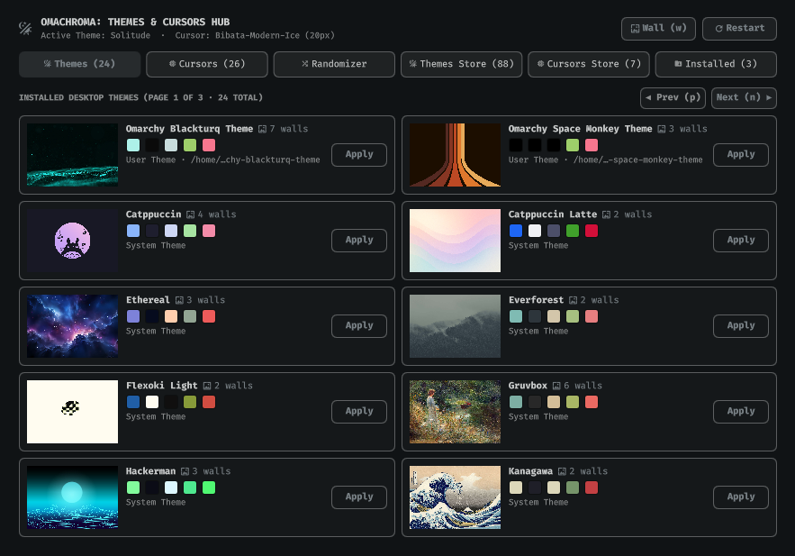
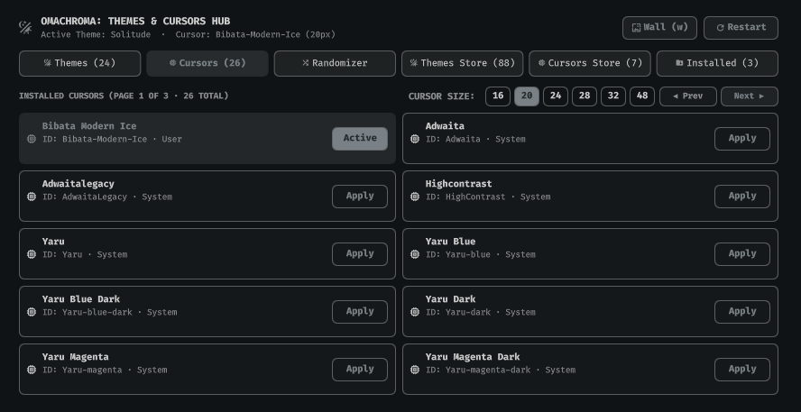
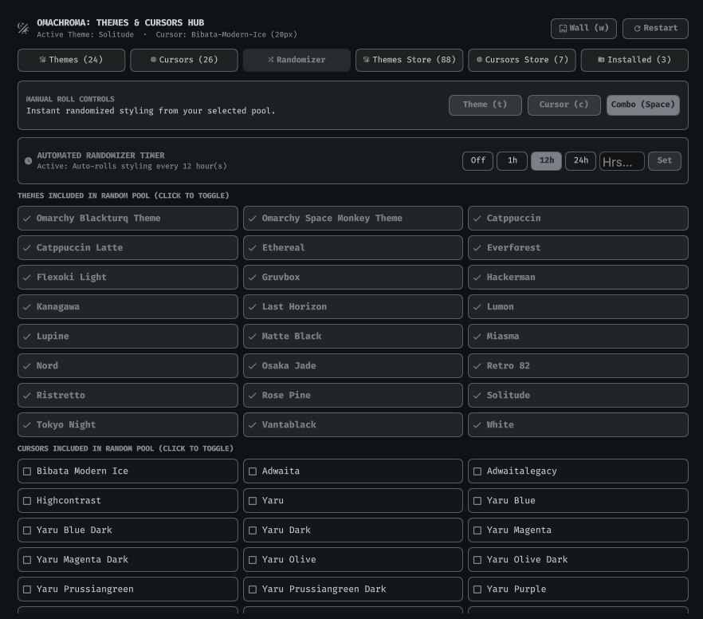
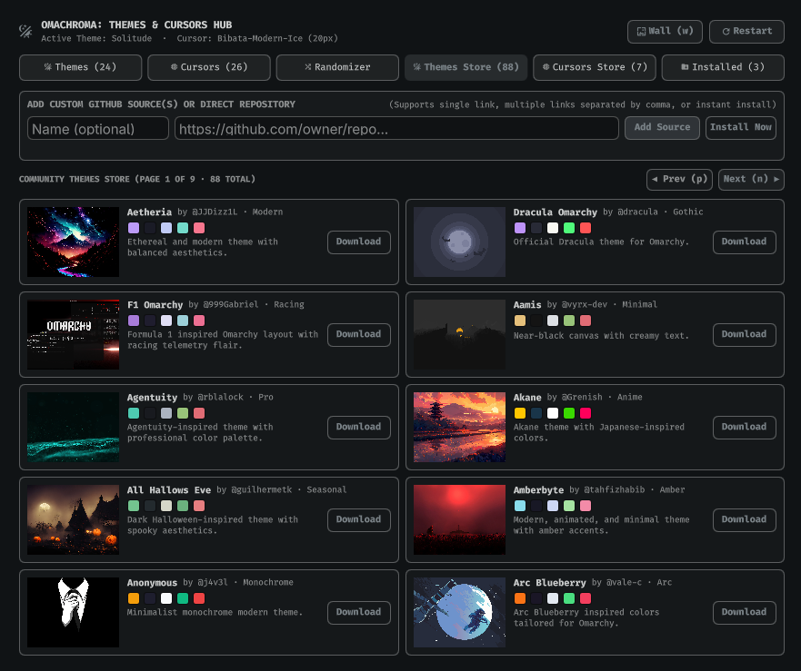
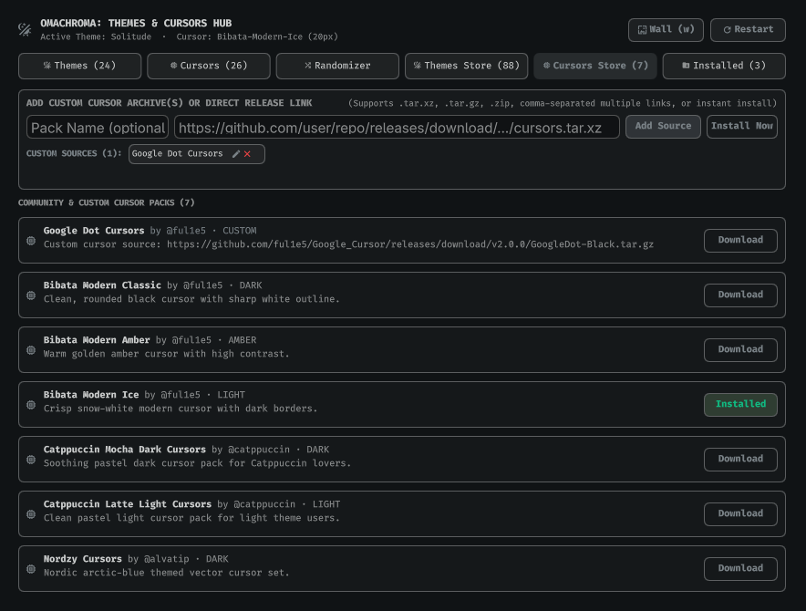

# OmaChroma

Desktop themes and cursor manager, downloader, and automated scheduler for Omarchy Quattro on Hyprland.



## Overview

OmaChroma brings a complete styling hub to the Omarchy Quattro shell:
* **Installed Themes**: Live wallpaper previews, color palette displays, and wallpaper count indicators with 1-click theme switching.
* **Installed Cursors & Size Slider**: Browse installed cursor themes and adjust cursor sizes dynamically across Hyprland and GTK.
* **Styling Randomizer**: Selectively pool favorite themes and cursor packs to roll random styling combos on demand.
* **Automated Background Scheduler**: Built-in cron daemon to auto-roll themes and cursors on custom intervals (Off, 1h, 12h, 24h, or custom hours).
* **Themes Store**: Browse and install 88+ community themes with pre-cached thumbnails. Supports adding, editing, and deleting custom Git repositories.
* **Cursors Store**: Discover curated cursor packages and manage custom release archive links (.tar.xz, .tar.gz, .zip) with inline source management.
* **Installed Manager**: View, inspect, and remove user-installed themes and cursor packs.

## Screenshots

| Themes Gallery | Cursors & Sizing |
|---|---|
|  |  |

| Styling Randomizer & Timer | Theme & Cursor Stores |
|---|---|
|  |  |

## Features and Capabilities

* **Live Thumbnail Previews**: Real wallpaper rendering for local and community themes.
* **Dynamic Palette Swatches**: Parsed colors.toml palettes showing accent, background, foreground, red, and green highlights.
* **Non-Blocking Execution**: Asynchronous Python worker processes with atomic file updates.
* **Source Management**: Add multiple Git repositories or direct release archives simultaneously without immediate cloning.
* **Keyboard Navigation**: Full keycatcher integration for keyboard-driven navigation, tab switching, and instant rolls.

## Installation

Install directly using the Omarchy Plugin Manager:

```bash
omaplug install kiryuuki.oma-chroma
```

## Keyboard Shortcuts

| Key | Action |
|---|---|
| `1` | Switch to Themes Tab |
| `2` | Switch to Cursors Tab |
| `3` | Switch to Randomizer Tab |
| `4` | Switch to Themes Store Tab |
| `5` | Switch to Cursors Store Tab |
| `6` | Switch to Installed Manager Tab |
| `j` / `Down` | Move selection down |
| `k` / `Up` | Move selection up |
| `Enter` / `Space` | Apply selected theme or cursor / Trigger combo roll |
| `t` | Randomize Theme Only |
| `c` | Randomize Cursor Only |
| `w` | Cycle Next Wallpaper |
| `n` / `]` / `>` | Next Page |
| `p` / `[` / `<` | Previous Page |
| `r` | Refresh status and catalog |
| `Esc` | Close panel |

## License

PolyForm Noncommercial 1.0.0 (PolyForm-Noncommercial-1.0.0). See [LICENSE](LICENSE) for details.
